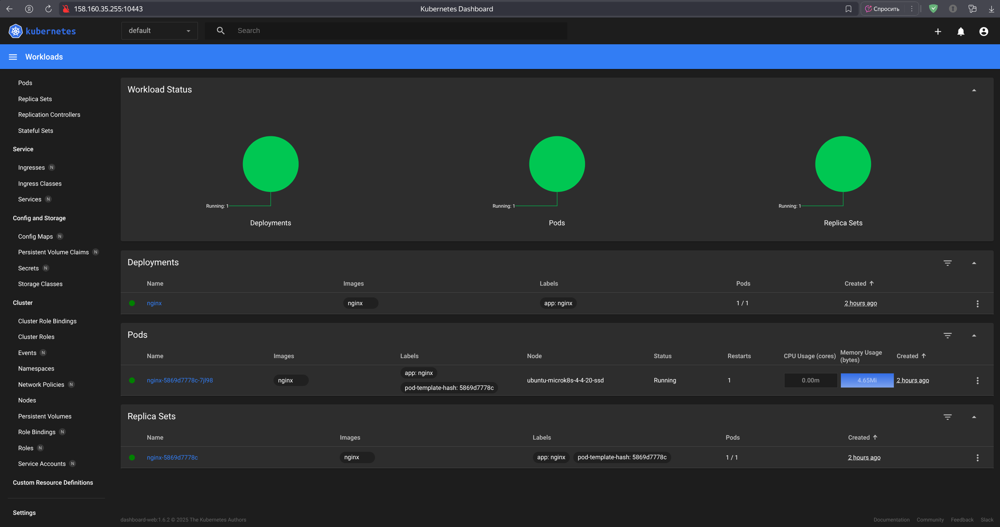

# Домашнее задание к занятию «Kubernetes. Причины появления. Команда kubectl»

### Цель задания

Для экспериментов и валидации ваших решений вам нужно подготовить тестовую среду для работы с Kubernetes. Оптимальное решение — развернуть на рабочей машине или на отдельной виртуальной машине MicroK8S.

------

### Чеклист готовности к домашнему заданию

1. Личный компьютер с ОС Linux или MacOS 

или

2. ВМ c ОС Linux в облаке либо ВМ на локальной машине для установки MicroK8S  

------

### Инструкция к заданию

1. Установка MicroK8S:
    - sudo apt update,
    - sudo apt install snapd,
    - sudo snap install microk8s --classic,
    - добавить локального пользователя в группу `sudo usermod -a -G microk8s $USER`,
    - изменить права на папку с конфигурацией `sudo chown -f -R $USER ~/.kube`.

2. Полезные команды:
    - проверить статус `microk8s status --wait-ready`;
    - подключиться к microK8s и получить информацию можно через команду `microk8s command`, например, `microk8s kubectl get nodes`;
    - включить addon можно через команду `microk8s enable`; 
    - список addon `microk8s status`;
    - вывод конфигурации `microk8s config`;
    - проброс порта для подключения локально `microk8s kubectl port-forward -n kube-system service/kubernetes-dashboard 10443:443`.

3. Настройка внешнего подключения:
    - отредактировать файл /var/snap/microk8s/current/certs/csr.conf.template
    ```shell
    # [ alt_names ]
    # Add
    # IP.4 = 123.45.67.89
    ```
    - обновить сертификаты `sudo microk8s refresh-certs --cert front-proxy-client.crt`.

4. Установка kubectl:
    - curl -LO https://storage.googleapis.com/kubernetes-release/release/`curl -s https://storage.googleapis.com/kubernetes-release/release/stable.txt`/bin/linux/amd64/kubectl;
    - chmod +x ./kubectl;
    - sudo mv ./kubectl /usr/local/bin/kubectl;
    - настройка автодополнения в текущую сессию `bash source <(kubectl completion bash)`;
    - добавление автодополнения в командную оболочку bash `echo "source <(kubectl completion bash)" >> ~/.bashrc`.

------

### Инструменты и дополнительные материалы, которые пригодятся для выполнения задания

1. [Инструкция](https://microk8s.io/docs/getting-started) по установке MicroK8S.
2. [Инструкция](https://kubernetes.io/ru/docs/reference/kubectl/cheatsheet/#bash) по установке автодополнения **kubectl**.
3. [Шпаргалка](https://kubernetes.io/ru/docs/reference/kubectl/cheatsheet/) по **kubectl**.

------

### Задание 1. Установка MicroK8S

1. Установить MicroK8S на локальную машину или на удалённую виртуальную машину.
2. Установить dashboard.
3. Сгенерировать сертификат для подключения к внешнему ip-адресу.

------  
### Решение 1.  
1. Установка MicroK8S:
    - `sudo apt update`,
    - `sudo apt install snapd`,
    - `sudo snap install microk8s --classic --channel=1.33`,
    - добавить локального пользователя в группу `sudo usermod -a -G microk8s $USER`,
    - создать папку `mkdir -p ~/.kube`
    - изменить права на папку с конфигурацией `sudo chown -f -R $USER ~/.kube`
    - повторно войти в сеанс, чтобы произошло обновление группы: `su - $USER`
    - `alias kubectl='microk8s kubectl'`  
    - `microk8s enable dns`
    - `microk8s enable hostpath-storage`  
2. Установка dashboard:
   `microk8s enable dashboard`  
3. Сгенерировать сертификат для подключения к внешнему ip-адресу:  
``` bash
    sudo nano /var/snap/microk8s/current/certs/csr.conf.template  
    ...
    Добавить строку:
    IP.3 = < ваш внешний публичный IP > 
    ...  
    Обновить сертификат:  
    sudo microk8s refresh-certs --cert front-proxy-client.crt
```  
Вывести все сервисы во всех пространств имён `kubectl get services --all-namespaces`   
```bash
NAMESPACE              NAME                                   TYPE        CLUSTER-IP       EXTERNAL-IP   PORT(S)                  AGE
default                kubernetes                             ClusterIP   10.152.183.1     <none>        443/TCP                  168m
kube-system            kube-dns                               ClusterIP   10.152.183.10    <none>        53/UDP,53/TCP,9153/TCP   168m
kube-system            metrics-server                         ClusterIP   10.152.183.58    <none>        443/TCP                  159m
kubernetes-dashboard   kubernetes-dashboard-api               ClusterIP   10.152.183.113   <none>        8000/TCP                 109m
kubernetes-dashboard   kubernetes-dashboard-auth              ClusterIP   10.152.183.217   <none>        8000/TCP                 109m
kubernetes-dashboard   kubernetes-dashboard-kong-proxy        ClusterIP   10.152.183.66    <none>        443/TCP                  109m
kubernetes-dashboard   kubernetes-dashboard-metrics-scraper   ClusterIP   10.152.183.59    <none>        8000/TCP                 109m
kubernetes-dashboard   kubernetes-dashboard-web               ClusterIP   10.152.183.79    <none>        8000/TCP                 109m
```
Подключиться к дашборду с помощью port-forward `microk8s kubectl -n kubernetes-dashboard port-forward svc/kubernetes-dashboard-kong-proxy 10443:443 --address 0.0.0.0`  
В браузере:  
  
При входе понадобится сгенерировать токен:
` microk8s kubectl -n kubernetes-dashboard create token kubernetes-dashboard-kong`  

--------------

### Задание 2. Установка и настройка локального kubectl
1. Установить на локальную машину kubectl.
2. Настроить локально подключение к кластеру.
3. Подключиться к дашборду с помощью port-forward.

------

### Правила приёма работы

1. Домашняя работа оформляется в своём Git-репозитории в файле README.md. Выполненное домашнее задание пришлите ссылкой на .md-файл в вашем репозитории.
2. Файл README.md должен содержать скриншоты вывода команд `kubectl get nodes` и скриншот дашборда.

------

### Критерии оценки
Зачёт — выполнены все задания, ответы даны в развернутой форме, приложены соответствующие скриншоты и файлы проекта, в выполненных заданиях нет противоречий и нарушения логики.

На доработку — задание выполнено частично или не выполнено, в логике выполнения заданий есть противоречия, существенные недостатки.
