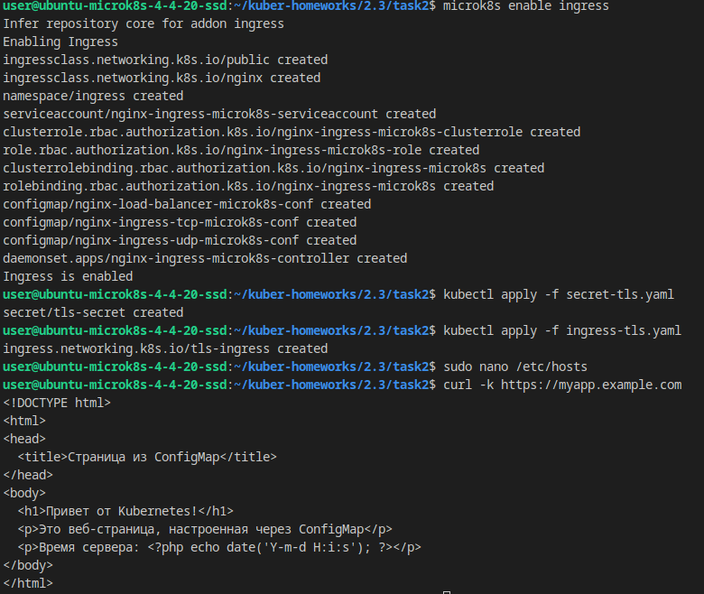
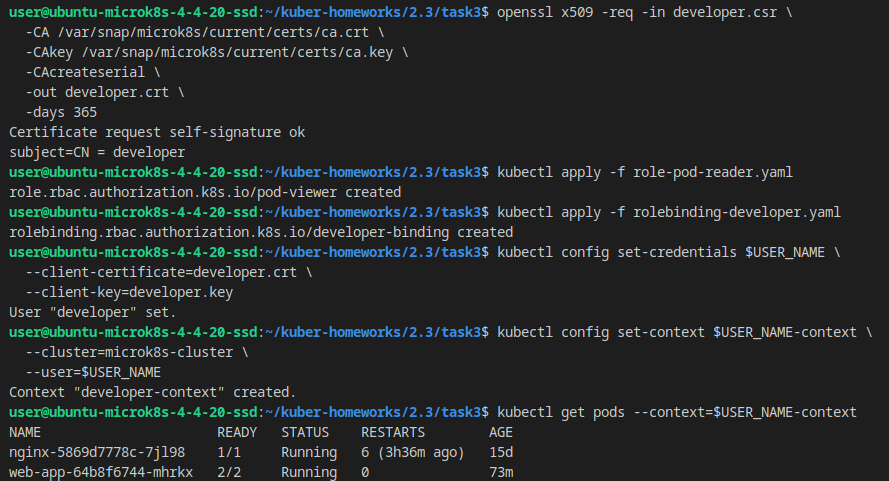

# Домашнее задание к занятию «Конфигурация приложений»

### Цель задания

В тестовой среде Kubernetes необходимо создать конфигурацию и продемонстрировать работу приложения.

------

### Чеклист готовности к домашнему заданию

1. Установленное K8s-решение (например, MicroK8s).
2. Установленный локальный kubectl.
3. Редактор YAML-файлов с подключённым GitHub-репозиторием.

------

### Инструменты и дополнительные материалы, которые пригодятся для выполнения задания

1. [Описание](https://kubernetes.io/docs/concepts/configuration/secret/) Secret.
2. [Описание](https://kubernetes.io/docs/concepts/configuration/configmap/) ConfigMap.
3. [Описание](https://github.com/wbitt/Network-MultiTool) Multitool.

------

### Задание 1. Создать Deployment приложения и решить возникшую проблему с помощью ConfigMap. Добавить веб-страницу

1. Создать Deployment приложения, состоящего из контейнеров nginx и multitool.
2. Решить возникшую проблему с помощью ConfigMap.
3. Продемонстрировать, что pod стартовал и оба конейнера работают.
4. Сделать простую веб-страницу и подключить её к Nginx с помощью ConfigMap. Подключить Service и показать вывод curl или в браузере.
5. Предоставить манифесты, а также скриншоты или вывод необходимых команд.

------  
### **Решение здания 1**  
  **Манифест** Deployment приложения: [**deployment.yaml**](./src/task1/deployment.yaml)  
  **Манифест**  для конфигурации контейнера multitul на порт 8080, (по умолчанию был 80 и конфликтовал с nginx-контейнером): [**multitool-configmap.yaml**](./src/task1/multitool-configmap.yaml)  
  **Манифест**  для подключения простой веб-страницы к Nginx с помощью ConfigMap: [**nginx-html-configmap.yaml**](./src/task1/nginx-html-configmap.yaml)  
  **Манифест**  для Service: [**service.yaml**](./src/task1/service.yaml)  
  
  **Скриншоты:**  
    
  
------  

## **Задание 2: Настройка HTTPS с Secrets**  
### **Задача**  
Развернуть приложение с доступом по HTTPS, используя самоподписанный сертификат.

### **Шаги выполнения**  
1. **Сгенерировать SSL-сертификат**
```bash
openssl req -x509 -nodes -days 365 -newkey rsa:2048 \
  -keyout tls.key -out tls.crt -subj "/CN=myapp.example.com"
```
2. **Создать Secret**
3. **Настроить Ingress**
4. **Проверить HTTPS-доступ**

### **Что сдать на проверку**  
- Манифесты:
  - `secret-tls.yaml`
  - `ingress-tls.yaml`
- Скриншот вывода `curl -k`

 ### **Решение задания 2** 
 - Манифесты:
  - [secret-tls.yaml](./src/task2/secret-tls.yaml)  
  - [ingress-tls.yaml](./src/task2/ingress-tls.yaml)  
  - [deployment.yaml](./src/task2/deployment.yaml)  
  - [configmap-web.yaml](./src/task2/configmap-web.yaml)  
- Скриншот вывода:
     
     

### Команды для применения:
```bash
# Включите ingress в microk8s если еще не сделано
microk8s enable ingress

kubectl apply -f configmap-web.yaml
kubectl apply -f deployment.yaml
openssl req -x509 -nodes -days 365 -newkey rsa:2048 \
  -keyout tls.key -out tls.crt -subj "/CN=myapp.example.com"  

# Замените $(cat tls.crt | base64 -w 0) и $(cat tls.key | base64 -w 0) на реальные base64-encoded значения
# в secret-tls.yaml  

kubectl apply -f secret-tls.yaml
kubectl apply -f ingress-tls.yaml  
```  
### Проверка:
```bash
# Добавьте запись в /etc/hosts
echo "127.0.0.1 myapp.example.com" | sudo tee -a /etc/hosts

# Проверка HTTPS
curl -k https://myapp.example.com  
```  

------ 
## **Задание 3: Настройка RBAC**  
### **Задача**  
Создать пользователя с ограниченными правами (только просмотр логов и описания подов).

### **Шаги выполнения**  
1. **Включите RBAC в microk8s**
```bash
microk8s enable rbac
```
2. **Создать SSL-сертификат для пользователя**
```bash
openssl genrsa -out developer.key 2048
openssl req -new -key developer.key -out developer.csr -subj "/CN={ИМЯ ПОЛЬЗОВАТЕЛЯ}"
openssl x509 -req -in developer.csr -CA {CA серт вашего кластера} -CAkey {CA ключ вашего кластера} -CAcreateserial -out developer.crt -days 365
```
3. **Создать Role (только просмотр логов и описания подов) и RoleBinding**
4. **Проверить доступ**

### **Что сдать на проверку**  
- Манифесты:
  - `role-pod-reader.yaml`
  - `rolebinding-developer.yaml`
- Команды генерации сертификатов
- Скриншот проверки прав (`kubectl get pods --as=developer`)

------

 ### **Решение задания 3** 
 - Манифесты:
  - [role-pod-reader.yaml](./src/task3/role-pod-reader.yaml)  
  - [rolebinding-developer.yaml](./src/task3/rolebinding-developer.yaml)  

- Скриншоты:
    
    
    
  