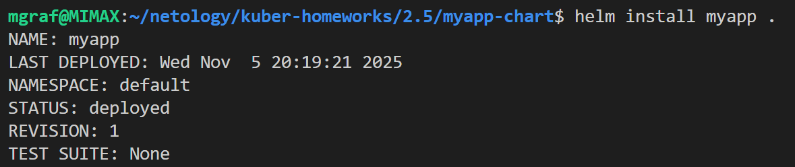
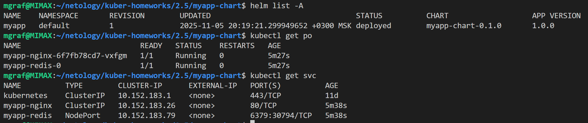
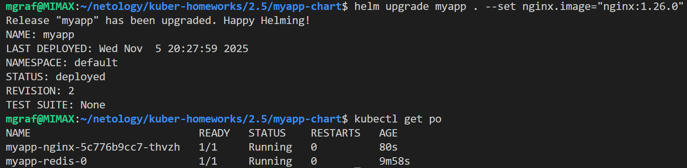
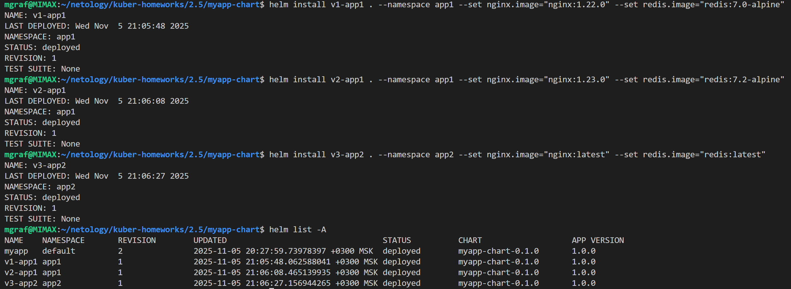
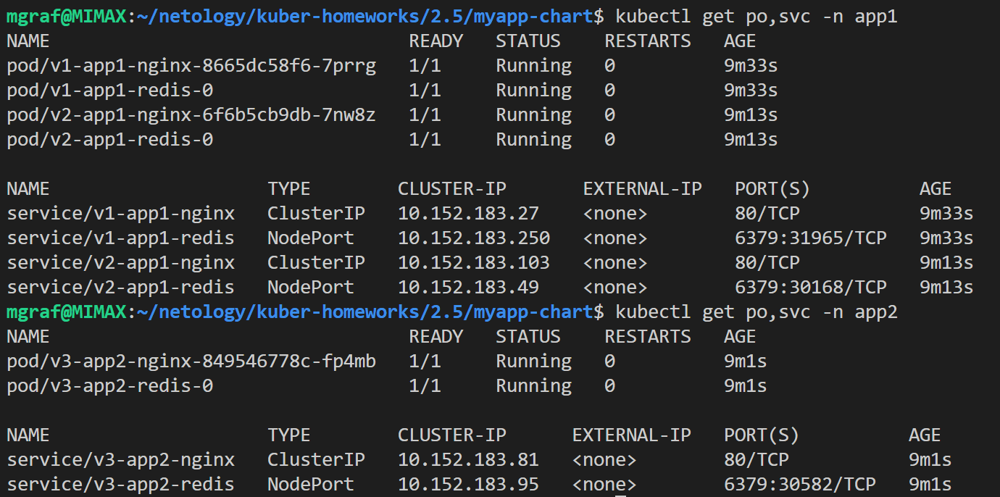

# Домашнее задание к занятию «Helm»

### Цель задания

В тестовой среде Kubernetes необходимо установить и обновить приложения с помощью Helm.

------

### Чеклист готовности к домашнему заданию

1. Установленное k8s-решение, например, MicroK8S.
2. Установленный локальный kubectl.
3. Установленный локальный Helm.
4. Редактор YAML-файлов с подключенным репозиторием GitHub.

------

### Инструменты и дополнительные материалы, которые пригодятся для выполнения задания

1. [Инструкция](https://helm.sh/docs/intro/install/) по установке Helm. [Helm completion](https://helm.sh/docs/helm/helm_completion/).

------

### Задание 1. Подготовить Helm-чарт для приложения

1. Необходимо упаковать приложение в чарт для деплоя в разные окружения. 
2. Каждый компонент приложения деплоится отдельным deployment’ом или statefulset’ом.
3. В переменных чарта измените образ приложения для изменения версии.
------
 ### **Решение задания 1**  
- Выполняем команду для создания чарта: 
```bash  
  helm create myapp-chart
```  
- Создаем:  
  [**nginx-deployment.yaml**](./myapp-chart/templates/nginx-deployment.yaml)  
  [**redis-statefulset.yaml**](./myapp-chart/templates/redis-statefulset.yaml)  
  [**Chart.yaml**](./myapp-chart/Chart.yaml)  
  [**values.yaml**](./myapp-chart/values.yaml)  

- Устанавливаем приложения командой:
```bash  
  helm install myapp .
```  
- Скриншоты:  
    
    
    
------
### Задание 2. Запустить две версии в разных неймспейсах

1. Подготовив чарт, необходимо его проверить. Запуститe несколько копий приложения.
2. Одну версию в namespace=app1, вторую версию в том же неймспейсе, третью версию в namespace=app2.
3. Продемонстрируйте результат.
------  
 ### **Решение задания 2**  
- Создаем два namespace app1 и app2:  
```bash  
kubectl create namespace app1
kubectl create namespace app2
```  
Установка первой версии в namespace app1:  
```bash  
helm install v1-app1 . --namespace app1 --set nginx.image="nginx:1.22.0" --set redis.image="redis:7.0-alpine" 
```
Установка второй версии в namespace app1:  
```bash  
helm install v2-app1 . --namespace app1 --set nginx.image="nginx:1.23.0" --set redis.image="redis:7.2-alpine" 
```
Установка третьей версии в namespace app2:  
```bash  
helm install v3-app2 . --namespace app2 --set nginx.image="nginx:latest" --set redis.image="redis:latest" 
```
Скриншоты выполения:  
  
  

------
### Правила приёма работы

1. Домашняя работа оформляется в своём Git репозитории в файле README.md. Выполненное домашнее задание пришлите ссылкой на .md-файл в вашем репозитории.
2. Файл README.md должен содержать скриншоты вывода необходимых команд `kubectl`, `helm`, а также скриншоты результатов.
3. Репозиторий должен содержать тексты манифестов или ссылки на них в файле README.md.

