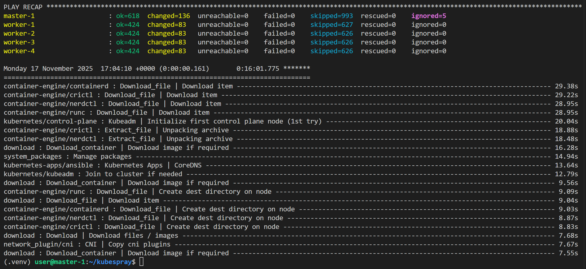
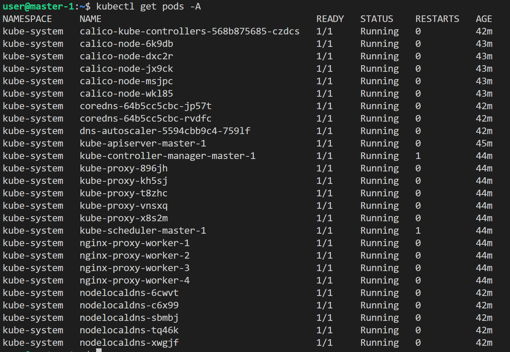
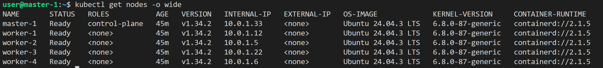

# Домашнее задание к занятию «Установка Kubernetes»

### Цель задания

Установить кластер K8s.

### Чеклист готовности к домашнему заданию

1. Развёрнутые ВМ с ОС Ubuntu 20.04-lts.


### Инструменты и дополнительные материалы, которые пригодятся для выполнения задания

1. [Инструкция по установке kubeadm](https://kubernetes.io/docs/setup/production-environment/tools/kubeadm/create-cluster-kubeadm/).
2. [Документация kubespray](https://kubespray.io/).

-----

### Задание 1. Установить кластер k8s с 1 master node

1. Подготовка работы кластера из 5 нод: 1 мастер и 4 рабочие ноды.
2. В качестве CRI — containerd.
3. Запуск etcd производить на мастере.
4. Способ установки выбрать самостоятельно.

-----------------------------

## Решение задания 1  

1. Создаем 5 виртуальных машин в yandex cloud с помощью terraform: 1 мастер и 4 рабочие ноды.
   Из каталога `terraform` выполняем команды: `terraform init`, `terraform plan`, `terraform apply`.  

```bash  
Apply complete! Resources: 8 added, 0 changed, 0 destroyed.

Outputs:

all_vms = [
  {
    "ip_external" = "89.169.133.68"
    "ip_internal" = "10.0.1.33"
    "name" = "master-1"
  },
  {
    "ip_external" = "158.160.103.240"
    "ip_internal" = "10.0.1.12"
    "name" = "worker-1"
  },
  {
    "ip_external" = "89.169.150.192"
    "ip_internal" = "10.0.1.5"
    "name" = "worker-2"
  },
  {
    "ip_external" = "89.169.131.212"
    "ip_internal" = "10.0.1.22"
    "name" = "worker-3"
  },
  {
    "ip_external" = "158.160.114.155"
    "ip_internal" = "10.0.1.6"
    "name" = "worker-4"
  },
]  

```  
1. Подключаемся к мастер-ноде и выполняем команду для клонирования kubespray из репозитория:  
```bash  
user@master-1:~$ git clone https://github.com/kubernetes-sigs/kubespray
Cloning into 'kubespray'...
remote: Enumerating objects: 84759, done.
remote: Counting objects: 100% (50/50), done.
remote: Compressing objects: 100% (30/30), done.
remote: Total 84759 (delta 36), reused 20 (delta 20), pack-reused 84709 (from 3)
Receiving objects: 100% (84759/84759), 27.51 MiB | 12.24 MiB/s, done.
Resolving deltas: 100% (47503/47503), done.
```
Проверяем выполнение: 
```bash  
user@master-1:~$ ls -la
total 32
drwxr-x---  5 user user 4096 Nov 17 16:28 .
drwxr-xr-x  3 root root 4096 Nov 17 16:26 ..
-rw-r--r--  1 user user  220 Mar 31  2024 .bash_logout
-rw-r--r--  1 user user 3771 Mar 31  2024 .bashrc
drwx------  2 user user 4096 Nov 17 16:28 .cache
-rw-r--r--  1 user user  807 Mar 31  2024 .profile
drwx------  2 user user 4096 Nov 17 16:26 .ssh
drwxrwxr-x 18 user user 4096 Nov 17 16:28 kubespray
```  

3. Установка зависимостей на master-ноде:  
```bash  
sudo apt update
sudo apt-get install python3-pip
sudo apt install python3.12-venv
cd kubespray
python3 -m venv .venv
source .venv/bin/activate
pip install -r requirements.txt
```  

4. Добавляем PRIVATE KEY на master-ноду чтобы ansible имел возможность подключаться к worker-ноде  

5. Добавляем inventory-файл для ansible на master-ноду: 
```yaml 
# ~/kubespray/inventory/mycluster/hosts.yaml
all:
  hosts:
    master-1:
      ansible_host: 89.169.133.68
      ip: 10.0.1.33
      access_ip: 89.169.133.68
    worker-1:
      ansible_host: 158.160.103.240
      ip: 10.0.1.12
      access_ip: 158.160.103.240
    worker-2:
      ansible_host: 89.169.150.192
      ip: 10.0.1.5
      access_ip: 89.169.150.192
    worker-3:
      ansible_host: 89.169.131.212
      ip: 10.0.1.22
      access_ip: 89.169.131.212
    worker-4:
      ansible_host: 158.160.114.155
      ip: 10.0.1.6
      access_ip: 158.160.114.155
  children:
    kube_control_plane:
      hosts:
        master-1:
    kube_node:
      hosts:
        worker-1:
        worker-2:
        worker-3:
        worker-4:
    etcd:
      hosts:
        master-1:
    k8s_cluster:
      children:
        kube_control_plane:
        kube_node:
    calico_rr:
      hosts: {}
```  
6. На master-ноде устанавливаем Kubernetes кластер с помощью ansible (выполнять команду при активированном виртуальном окружении `source .venv/bin/activate` из директории `kubespray/`):  
   
```bash  
ansible-playbook -i inventory/mycluster/hosts.yaml -u user --become --become-user=root --private-key=~/.ssh/id_rsa -e 'ansible_ssh_common_args="-o StrictHostKeyChecking=no"' cluster.yml --flush-cache  
```  
Результат выполнения команды:  
     

7. Далее выполняем команды на master ноде:
```bash  
  mkdir -p $HOME/.kube  
  cp -i /etc/kubernetes/admin.conf $HOME/.kube/config  
  chown $(id -u):$(id -g) $HOME/.kube/config  
```  
8. Результаты:  
Проверяем поды:  
      
Проверяем ноды:  
      
   
--------

## Дополнительные задания (со звёздочкой)

**Настоятельно рекомендуем выполнять все задания под звёздочкой.** Их выполнение поможет глубже разобраться в материале.   
Задания под звёздочкой необязательные к выполнению и не повлияют на получение зачёта по этому домашнему заданию. 

------
### Задание 2*. Установить HA кластер

1. Установить кластер в режиме HA.
2. Использовать нечётное количество Master-node.
3. Для cluster ip использовать keepalived или другой способ.

### Правила приёма работы

1. Домашняя работа оформляется в своем Git-репозитории в файле README.md. Выполненное домашнее задание пришлите ссылкой на .md-файл в вашем репозитории.
2. Файл README.md должен содержать скриншоты вывода необходимых команд `kubectl get nodes`, а также скриншоты результатов.
3. Репозиторий должен содержать тексты манифестов или ссылки на них в файле README.md.
